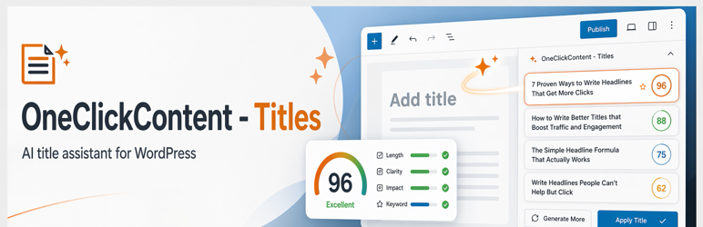

# OneClickContent - Titles

Version: 2.1.2

Free BYO-key AI title assistant for WordPress from the OneClickContent plugin line. Use your own OpenAI or Google Gemini API key to generate, compare, score, and apply post titles directly in the editor.

OneClickContent is the home for free, bring-your-own-key AI plugins for WordPress. `OneClickContent - Titles` gives writers, editors, marketers, and site owners a practical headline workflow without locking them into a bundled AI subscription.

## Key Features

- Free plugin from the OneClickContent bring-your-own-key AI plugin line.
- Generate multiple title options from post content inside the WordPress editor.
- Compare options with scoring, keyword fit, preview width, and title quality signals.
- Apply winning titles directly in the editor.
- Support for OpenAI and Google Gemini providers.
- GPT-5.5 is the default OpenAI model for new installs, with model choices loaded from the OpenAI account when available.
- Load Google Gemini model choices from the API when available.
- Built-in training and help screens for editorial teams.
- Keep the workflow inside WordPress instead of bouncing between external AI tools and the editor.

## What Is New In v2.1.2

- GPT-5.5 is now the default OpenAI model for new installs and unset model fallbacks.
- OpenAI model selection continues to load from the OpenAI Models API, so connected accounts can select GPT-5.5 when available.
- Refreshed the WordPress.org release package with updated banner, icon, and cropped real-plugin screenshots.
- Updated the GitHub and WordPress.org readme copy for the current release.

## What Is New In v2.1.1

- Posts and pages are enabled by default on fresh installs.
- Legacy installs that were still using the old posts-only default now normalize to include pages unless the post-type setting was explicitly customized.
- Fixes the missing editor control on page edit screens caused by the old default.

## What Is New In v2.1.0

- Repositioned the plugin as a free, bring-your-own-key AI title assistant for WordPress.
- Added live Google Gemini model loading from the Models API with caching and safe fallbacks.
- Switched Gemini generation to structured JSON output and improved provider error handling.
- Refined the editor, settings, and help screens for a simpler editorial workflow.
- Tightened the release package so `npm run dist` produces an install-ready zip.

## Best Fit

This plugin is a strong fit for:

- WordPress blogs and publisher workflows
- content teams that want faster headline ideation
- SEO-minded sites that want keyword-aware title suggestions
- site owners who want AI help without SaaS lock-in

## Quick Start

1. Install and activate the plugin.
2. Go to `Settings -> Title Assistant`.
3. Configure provider and API key.
4. Open a post in the editor.
5. Click **Generate Titles**.
6. Compare results and click **Apply** on the best one.

## Pricing Model

This plugin is free. OneClickContent's model is simple: bring your own API key, use the provider you prefer, and pay that provider directly only if they charge for usage.

## Why BYO Key

The bring-your-own-key model gives you control over provider choice, usage, and cost. It also keeps the plugin lightweight and avoids locking editorial teams into another hosted subscription just to improve titles.

## Training Page

The plugin includes an editor training page at:

- `Settings -> Title Help`

It includes:

- Step-by-step usage guidance.
- Title quality best practices.
- Control and label definitions.
- Self-contained placeholder panels your team can replace with local screenshots later.

## WordPress.org Screenshot Set

Use real wp-admin screenshots only. Do not use browser chrome, mockups, marketing overlays, or composites in the WordPress.org screenshot set.

Recommended final order:

1. `screenshot-1.png` - Post editor workflow showing `Title Recommendations`, the top generated title, score/grade, quality signals, `Apply this title`, `2 More options`, and `Open full breakdown`.
   Caption: Generate title recommendations directly inside the WordPress post editor, then compare scores and apply the best option without leaving the page.
2. `screenshot-2.png` - Settings page at `options-general.php?page=occ_titles-settings` showing `Title Assistant` in the Settings menu, setup progress, provider/API connection, editor locations, diagnostics, and brand voice.
   Caption: Configure your AI provider, enabled editor locations, diagnostics, and brand voice from the guided Title Assistant settings page.
3. `screenshot-3.png` - Post editor workflow while a fresh title batch is being generated, showing the loading state and content-aware title guidance.
   Caption: See the in-editor generation workflow with content-aware guidance while a fresh title batch is created.
4. `screenshot-4.png` - Optional replacement/additional editor shot with `Generation Controls` expanded, including goal, style, keyword targets, and the `Generate Titles` button.
   Caption: Choose the goal, style, and keyword targets before generating a fresh batch of title ideas.
5. `screenshot-5.png` - Optional replacement/additional editor shot with the full breakdown expanded, showing detailed comparison signals and export tools.
   Caption: Review the full title breakdown with scoring, keyword fit, readability, preview width, and export tools before choosing a title.

## Privacy

This plugin sends post content to your selected provider for title generation.

- OpenAI: https://openai.com/privacy
- Google: https://policies.google.com/privacy

## Changelog

### 2.1.2

- Added GPT-5.5 as the default OpenAI model for new installs and unset model fallbacks.
- Kept OpenAI model choices provider-loaded so GPT-5.5 appears when available on the connected account.
- Refreshed release assets and readme copy for WordPress.org.

### 2.1.1

- Enable posts and pages by default for new installs.
- Normalize the old posts-only default to include pages unless the post-type setting was manually customized.
- Fix missing editor controls on page edit screens caused by the legacy default.

### 2.1.0

- Free bring-your-own-key positioning and documentation refresh for release.
- Added live Google Gemini model loading and safer structured-output parsing.
- Improved editor, settings, and help UX.
- Tightened dist packaging and install-ready zip validation.

### 2.0.1

- Added per-user/per-post generation cooldown enforcement on AJAX title generation.
- Changed API key validation trigger to field completion (`change`/`blur`) instead of continuous typing events.
- Stability and hardening update for production deployments.

### 2.0.0

- Major release with workflow, scoring, settings, and training improvements.
- Documentation refresh for both GitHub and WordPress.org distribution.

### 1.1.0

- Added Google Gemini provider support.
- Improved title generation workflow and settings.
- Added richer scoring and title comparison experience.

## License

GPLv2 or later.
