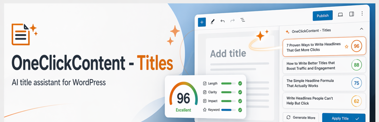
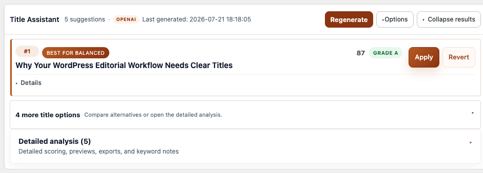
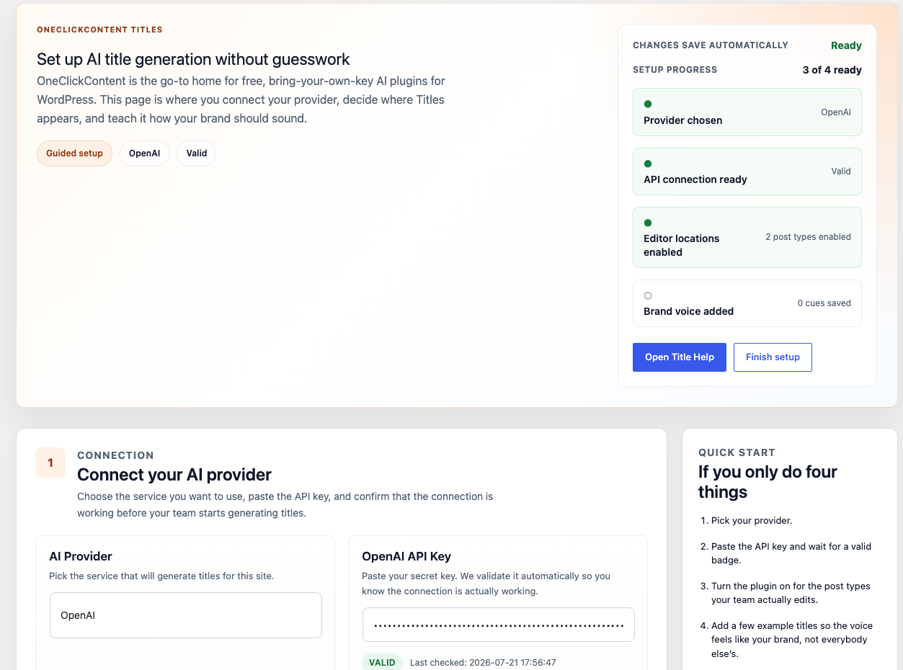
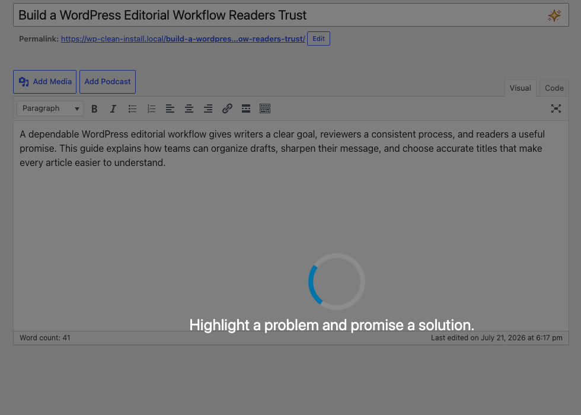

# OneClickContent - Titles

Version: 2.1.6

Free BYO-key AI title assistant for WordPress from the OneClickContent plugin line. Use your own OpenAI or Google Gemini API key to generate, compare, score, and apply post titles directly in the editor.

OneClickContent is the home for free, bring-your-own-key AI plugins for WordPress. `OneClickContent - Titles` gives writers, editors, marketers, and site owners a practical headline workflow without locking them into a bundled AI subscription.

## Key Features

- Free plugin from the OneClickContent bring-your-own-key AI plugin line.
- Generate multiple title options from post content inside the WordPress editor.
- Compare options with scoring, keyword fit, preview width, and title quality signals.
- Apply winning titles directly in the editor.
- Support for OpenAI and Google Gemini providers.
- GPT-5.5 is the tested automatic OpenAI choice, with explicit saved model selections preserved.
- Load Google Gemini model choices from the API when available.
- Built-in training and help screens for editorial teams.
- Keep the workflow inside WordPress instead of bouncing between external AI tools and the editor.

## What Is New In v2.1.6

- Fixed OpenAI generation for models that reject the `temperature` parameter.
- Added a tested automatic model choice without replacing explicit saved selections.
- Made the editor workflow more compact with state-aware Options, Undo, and result controls.
- Restored the Title Assistant launcher in Classic Editor plus Block Editor Visual and Code views.
- Fixed Apply so it updates the canonical Block Editor title store, with a visible-field fallback for editor compatibility.
- Stopped background result reloads from resetting open details, so Details and Detailed analysis respond on the first click.
- Made diagnostic logging opt-in on new installations and expanded external-service disclosures.
- Hardened uninstall cleanup, minimum WordPress compatibility, translations, tests, and the release workflow.

## What Is New In v2.1.5

- Confirmed compatibility with WordPress 7.0.
- Updated WordPress.org metadata to `Tested up to: 7.0`.
- Updated the Docker PHPUnit harness so WordPress core caches refresh when the requested test version changes.

## What Is New In v2.1.4

- Updated `assets/icon.svg` so the WordPress.org SVG icon matches the current PNG icon artwork.

## What Is New In v2.1.3

- Shortened the WordPress.org short description so the directory import no longer truncates it.
- Kept the GPT-5.5 default OpenAI model update from v2.1.2 intact.

## What Is New In v2.1.2

- GPT-5.5 is now the default OpenAI model for new installs and unset model fallbacks.
- OpenAI model selection continues to load from the OpenAI Models API, so connected accounts can select GPT-5.5 when available.
- Refreshed the WordPress.org release package with updated banner, icon, and cropped real-plugin screenshots.
- Updated the GitHub and WordPress.org readme copy for the current release.

## What Is New In v2.1.1

- Posts and pages are enabled by default on fresh installs.
- Legacy installs that were still using the old posts-only default now normalize to include pages unless the post-type setting was explicitly customized.
- Fixes the missing editor control on page edit screens caused by the old default.

## What Is New In v2.1.0

- Repositioned the plugin as a free, bring-your-own-key AI title assistant for WordPress.
- Added live Google Gemini model loading from the Models API with caching and safe fallbacks.
- Switched Gemini generation to structured JSON output and improved provider error handling.
- Refined the editor, settings, and help screens for a simpler editorial workflow.
- Tightened the release package so `npm run dist` produces an install-ready zip.

## Best Fit

This plugin is a strong fit for:

- WordPress blogs and publisher workflows
- content teams that want faster headline ideation
- SEO-minded sites that want keyword-aware title suggestions
- site owners who want AI help without SaaS lock-in

## Quick Start

1. Install and activate the plugin.
2. Go to `Settings -> Title Assistant`.
3. Configure provider and API key.
4. Open a post in the editor.
5. Click **Generate Titles**.
6. Compare results and click **Apply** on the best one.

## Pricing Model

This plugin is free. OneClickContent's model is simple: bring your own API key, use the provider you prefer, and pay that provider directly only if they charge for usage.

## Why BYO Key

The bring-your-own-key model gives you control over provider choice, usage, and cost. It also keeps the plugin lightweight and avoids locking editorial teams into another hosted subscription just to improve titles.

## Training Page

The plugin includes an editor training page at:

- `Settings -> Title Help`

It includes:

- Step-by-step usage guidance.
- Title quality best practices.
- Control and label definitions.
- Built-in visual workflow examples that match the current editor and settings experience.

## Screenshots

### Compare and apply title recommendations in the editor

Generate a ranked set of recommendations from the post you are already editing. Review the strongest option first, compare its quality signals, and apply it without leaving WordPress.

### Configure the assistant for your editorial workflow

Connect your preferred provider, choose the editor locations where the assistant appears, keep diagnostics under your control, and add brand-voice guidance from one settings screen.

### Keep context while a fresh batch is generated

The generation state stays inside the editor and provides concise content-aware guidance while the provider creates the next set of title ideas.

## External Services and Privacy

This plugin connects to OpenAI or Google Gemini only for provider features you configure. It does not include tracking or send data to OneClickContent.

API-key validation and model loading send the configured key to the selected provider. Google validation also sends a short test prompt. Title generation sends post content, generation instructions, selected controls, and configured brand-voice guidance. API keys and generated results are stored in WordPress. Optional troubleshooting logs are disabled by default on new installations and redact API keys.

- OpenAI terms: https://openai.com/policies/terms-of-use/
- OpenAI privacy: https://openai.com/privacy
- Google Gemini API terms: https://ai.google.dev/gemini-api/terms
- Google privacy: https://policies.google.com/privacy

## Changelog

### 2.1.6

- Fixed OpenAI generation compatibility for models that do not support `temperature`.
- Added automatic provider model choices while preserving explicit selections.
- Compacted the editor interface and restored the launcher in Classic Editor plus both Block Editor views.
- Made title application reliable in Gutenberg and stabilized first-click detail interactions.
- Made new-install diagnostics opt-in and expanded external-service disclosures.
- Hardened uninstall cleanup, compatibility checks, translations, tests, and release tooling.

### 2.1.5

- Added WordPress 7.0 compatibility metadata.
- Pinned Docker PHPUnit runs to WordPress 7.0 by default and made cached WordPress core version-aware.

### 2.1.4

- Refreshed the WordPress.org SVG icon to match the current PNG icon set.

### 2.1.3

- Shortened the WordPress.org short description to stay within the plugin directory import limit.
- Re-released the current GPT-5.5 default update with corrected readme metadata.

### 2.1.2

- Added GPT-5.5 as the default OpenAI model for new installs and unset model fallbacks.
- Kept OpenAI model choices provider-loaded so GPT-5.5 appears when available on the connected account.
- Refreshed release assets and readme copy for WordPress.org.

### 2.1.1

- Enable posts and pages by default for new installs.
- Normalize the old posts-only default to include pages unless the post-type setting was manually customized.
- Fix missing editor controls on page edit screens caused by the legacy default.

### 2.1.0

- Free bring-your-own-key positioning and documentation refresh for release.
- Added live Google Gemini model loading and safer structured-output parsing.
- Improved editor, settings, and help UX.
- Tightened dist packaging and install-ready zip validation.

### 2.0.1

- Added per-user/per-post generation cooldown enforcement on AJAX title generation.
- Changed API key validation trigger to field completion (`change`/`blur`) instead of continuous typing events.
- Stability and hardening update for production deployments.

### 2.0.0

- Major release with workflow, scoring, settings, and training improvements.
- Documentation refresh for both GitHub and WordPress.org distribution.

### 1.1.0

- Added Google Gemini provider support.
- Improved title generation workflow and settings.
- Added richer scoring and title comparison experience.

## License

GPLv2 or later.
